# Advanced Animations 1

To use this scenes you have to download [this](https://github.com/Elteoremadebeethoven/MyAnimations/blob/master/screen_grid/screen_grid.py) code.

```python
from manimlib.imports import *
from screen_grid import ScreenGrid

class Scene(Scene):
    CONFIG = {
        "camera_config":{"background_color":"#161616"},
        "include_grid":True
    }
    def setup(self):
        if self.include_grid:
            self.add(ScreenGrid().fade(0.7))
```

## 1. Methods as animations

In manimlib/mobject/mobject.py we can see this:

```python
    def to_edge(self, edge=LEFT, buff=DEFAULT_MOBJECT_TO_EDGE_BUFFER):
    #                 ----------
    # Default:
    #           edge = LEFT
    #           buff = DEFAULT_MOBJECT_TO_EDGE_BUFFER
```

### ToEdgeAnimation1

```python
class ToEdgeAnimation1(Scene):
    def construct(self):
        mob = Circle()

        self.add(mob)
        self.play(
                # If we do not enter parameters then 
                # the animation will use the default ones
                mob.to_edge,
            )
        self.wait()
```

<p align="center">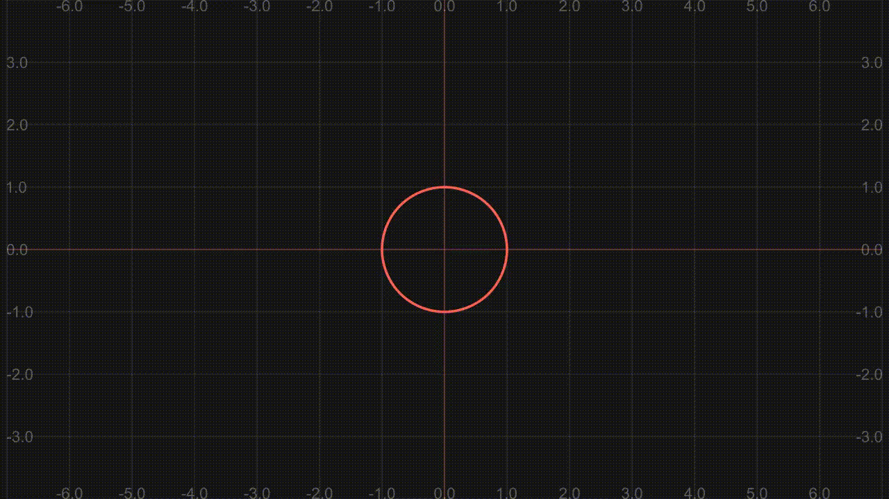</p>

### ToEdgeAnimation2

```python
class ToEdgeAnimation2(Scene):
    def construct(self):
        mob = Circle()

        self.add(mob)
        self.play(
                #            edge
                mob.to_edge, UP  
            )
        self.wait()
```

<p align="center">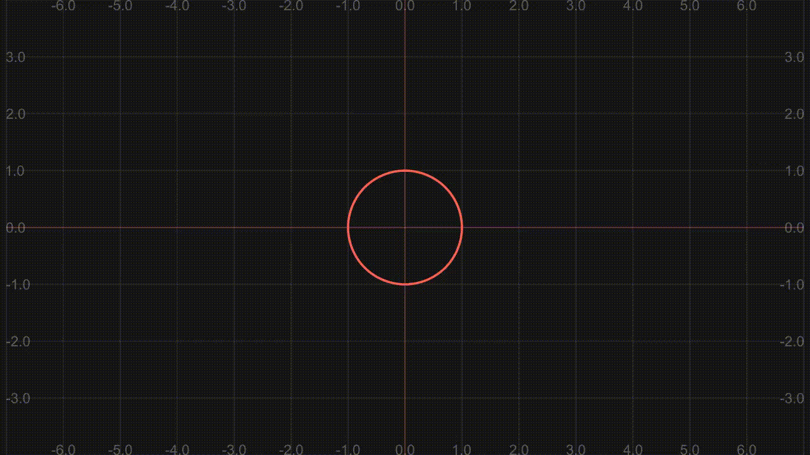</p>

### ToEdgeAnimation3

```python
class ToEdgeAnimation3(Scene):
    def construct(self):
        mob = Circle()

        self.add(mob)
        self.play(
                #            edge, buff
                mob.to_edge, UP  , 0
            )
        self.wait()
```

<p align="center">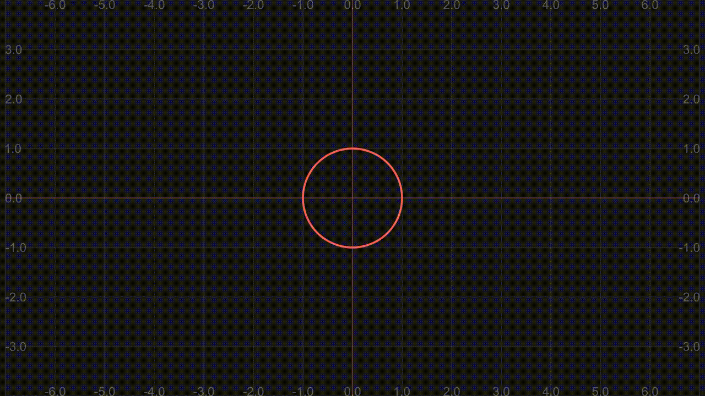</p>

### ToEdgeAnimation4

```python
class ToEdgeAnimation4(Scene):
    def construct(self):
        mob = Circle()

        self.add(mob)
        self.play(
                # To modify only a single paramter
                # the edge = LEFT by default
                mob.to_edge,{"buff":0},
            )
        self.wait()
```

<p align="center">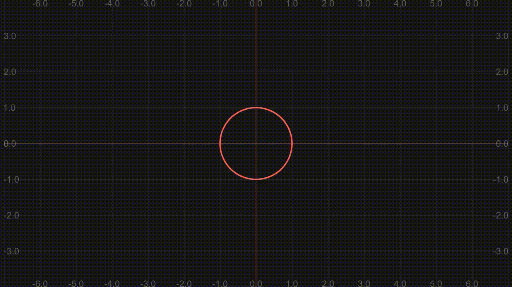</p>

### ToEdgeAnimation5

```python
class ToEdgeAnimation5(Scene):
    def construct(self):
        mob = Circle()

        self.add(mob)
        self.play(
                # Order matters
                mob.scale,0.5,
                mob.to_edge,{"buff":0},
            )
        self.wait()
```

<p align="center">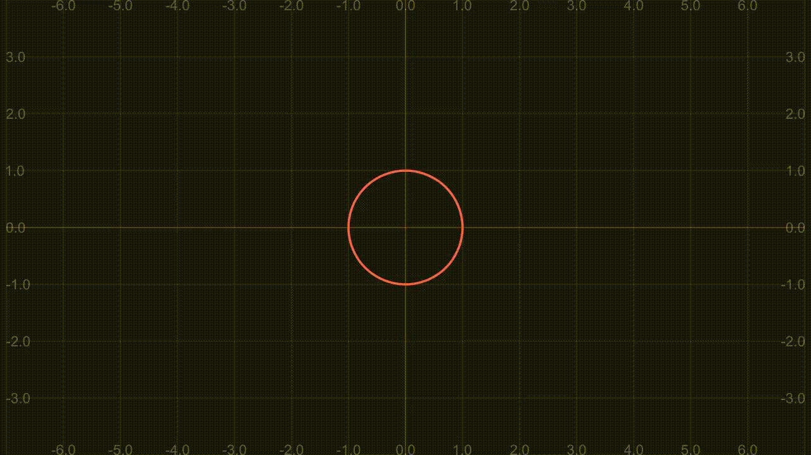</p>

### ToEdgeAnimation6

```python
class ToEdgeAnimation6(Scene):
    def construct(self):
        mob = Circle()
        mob.generate_target()
        # Order still matters
        mob.target.scale(0.1)
        mob.target.to_edge(RIGHT,buff=0)

        self.add(mob)
        self.play(
                MoveToTarget(mob)
            )
        self.wait()
```

<p align="center">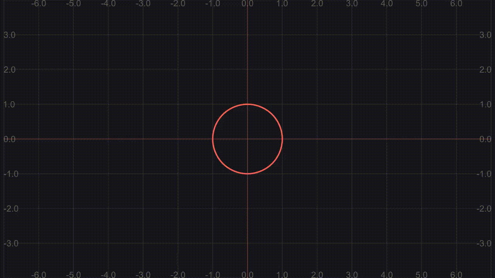</p>

### ScaleAnimation

```python
class ScaleAnimation(Scene):
    def construct(self):
        mob = Circle()
        dot = Dot([6,0,0])

        self.add(mob,dot)
        self.play(
                mob.scale,3
            )
        self.play(
                # But if we want more args we have to use a dictionary
                mob.scale,1/3,{"about_point":dot.get_center()}
                # Replace dot.get_center() with ORIGIN
            )
        self.wait()
```

<p align="center">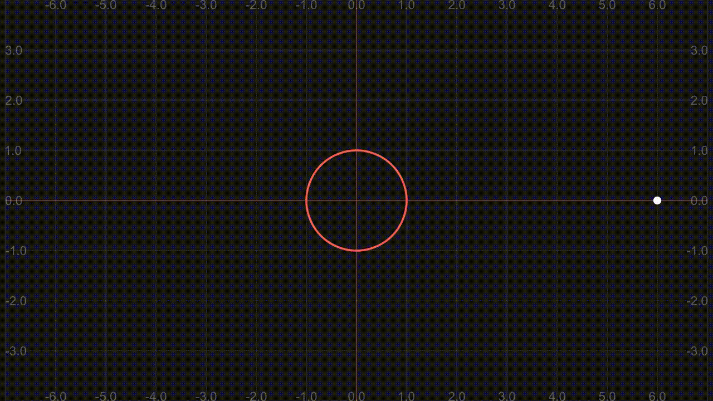</p>

### ArrangeAnimation1

```python
"""
    def arrange(self, direction=RIGHT, center=True, **kwargs):
                      -----------------------------
"""

class ArrangeAnimation1(Scene):
    def construct(self):
        vgroup = VGroup(
                    Square(),
                    Circle()
                )
        self.add(vgroup)
        self.wait()
        self.play(vgroup.arrange,DOWN)
        self.wait()
```

<p align="center">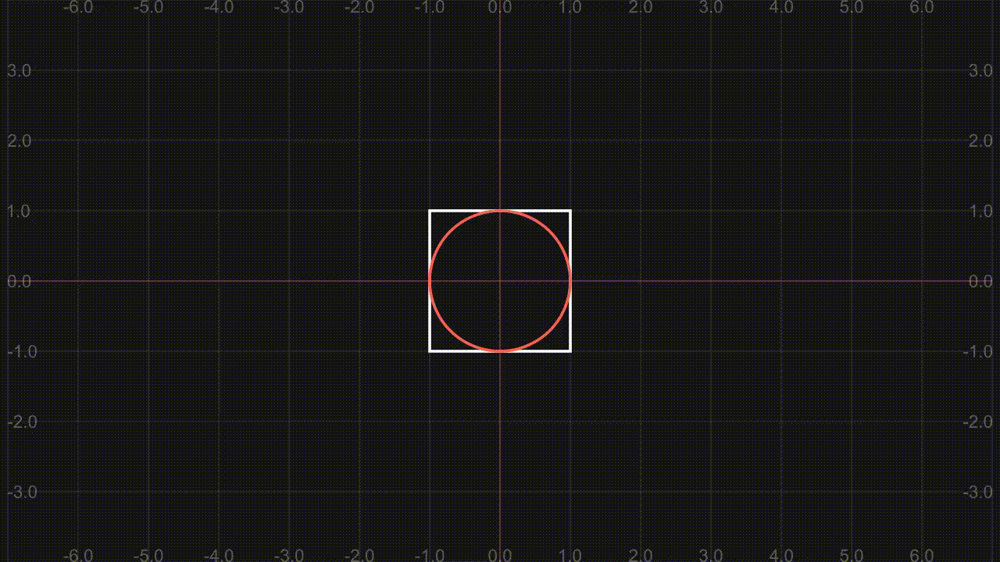</p>

### ArrangeAnimation2

```python
class ArrangeAnimation2(Scene):
    def construct(self):
        vgroup = VGroup(
                    Square(),
                    Circle()
                )
        self.add(vgroup)
        self.wait()
        self.play(vgroup.arrange,DOWN,{"buff":0})
        self.wait()
```

<p align="center"></p>

### ArrangeAnimation3

```python
class ArrangeAnimation3(Scene):
    def construct(self):
        vgroup = VGroup(
                    Square(),
                    Circle()
                )
        text = TextMobject("Hello world").to_corner(UL)
        self.add(vgroup)
        self.wait()
        self.play(
                vgroup.arrange,DOWN,{"buff":0},
                Write(text)
            )
        self.wait()
```

<p align="center"></p>

### ShiftAnimation1Fail

```python
"""
    def shift(self, *vectors):
                    --------
                     args
"""

class ShiftAnimation1Fail(Scene):
    def construct(self):
        mob = Circle()

        self.add(mob)
        self.play(
                # We can set "n" paraters
                FadeToColor(mob,TEAL),
                mob.shift,LEFT,LEFT,
                # FadeToColor is a MoveToTarget method
            )
        self.wait()
```

<p align="center">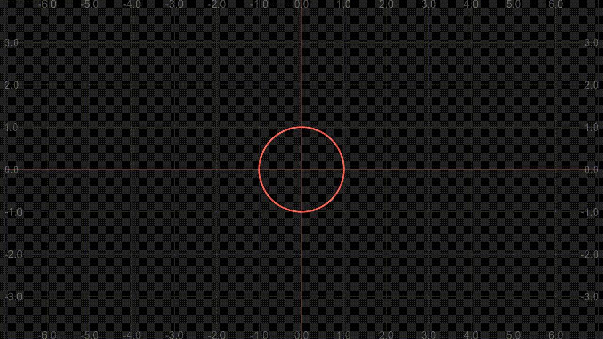</p>

### ShiftAnimation1

```python
class ShiftAnimation1(Scene):
    def construct(self):
        mob = Circle()

        self.add(mob)
        self.play(
                mob.shift,LEFT,LEFT,LEFT,
                mob.set_color,TEAL,
                #             Color,width,opacity
                mob.set_stroke,None,20,
                mob.scale,2,
            )
        self.wait()
```

<p align="center">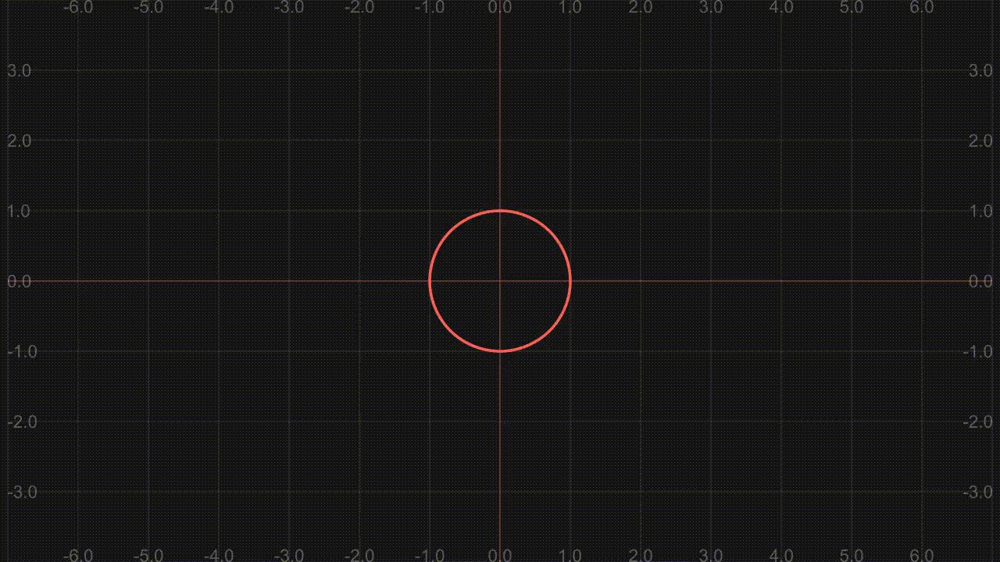</p>

## 2. Problems with VGroup

### MultipleAnimationVGroupFail

```python
class MultipleAnimationVGroupFail(Scene):
    def construct(self):
        rect, circ = Rectangle(), Circle()
        vgroup = VGroup(rect, circ)

        self.add(vgroup)
        self.play(
                vgroup.arrange,DOWN,
                rect.set_height,1,
            )
        self.wait()
```

<p align="center"></p>

### MultipleAnimationVGroup

```python
class MultipleAnimationVGroup(Scene):
    def construct(self):
        rect, circ = Rectangle(), Circle()
        vgroup = VGroup(rect, circ)

        def modify(vg):
            r,c = vg
            r.set_height(1)
            vg.arrange(DOWN,buff=2)
            return vg

        self.add(vgroup)
        self.play(
                ApplyFunction(modify, vgroup)
            )
        self.wait()
```

<p align="center">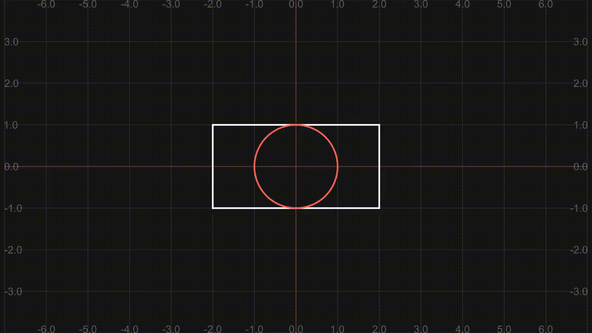</p>

### RotationAnimationFail

```python
"""
    def rotate(self, angle, axis=OUT, **kwargs):
"""

class RotationAnimationFail(Scene):
    def construct(self):
        square1, square2 = VGroup(
            Square(), 
            Square(color=TEAL)
        ).scale(0.3).set_y(-3)
        reference = DashedVMobject(Circle(radius=3,color=GRAY))

        self.add(square1,square2,reference)
        self.play(
            # White square
            square1.rotate,2*PI/3,{"about_point":ORIGIN},
            # Teal square
            Rotate(square2,2*PI/3,about_point=ORIGIN),
            run_time=4
            )
        self.wait()
```

<p align="center">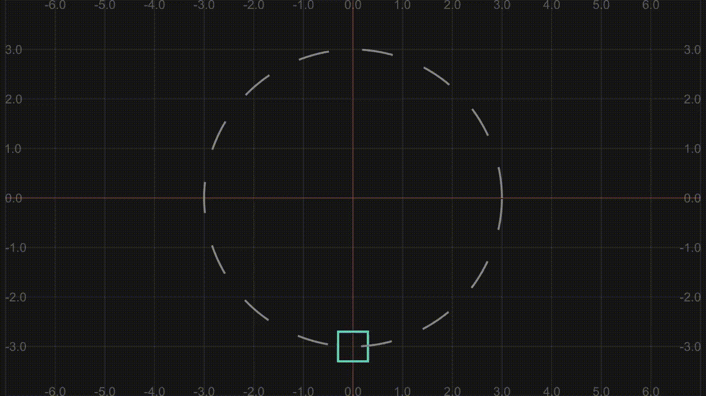</p>

### RotationAndMoveFail

```python
class RotationAndMoveFail(Scene):
    def construct(self):
        square1, square2 = VGroup(
                Square(color=RED), Square(color=BLUE)
            ).scale(0.5).set_x(-5)

        reference = DashedVMobject(Line(LEFT*5,RIGHT*5,color=GRAY))
        self.add(square1,square2,reference)

        square2.save_state()
        def update_rotate_move(mob,alpha):
            square2.restore()
            square2.shift(RIGHT*10*alpha)
            square2.rotate(3*PI*alpha)

        self.play(
                # Red square FAIL
                square1.rotate,3*PI,
                square1.move_to, [5,0,0],
                # Blue square
                UpdateFromAlphaFunc(square2,update_rotate_move),
                run_time=4
            )
```

<p align="center">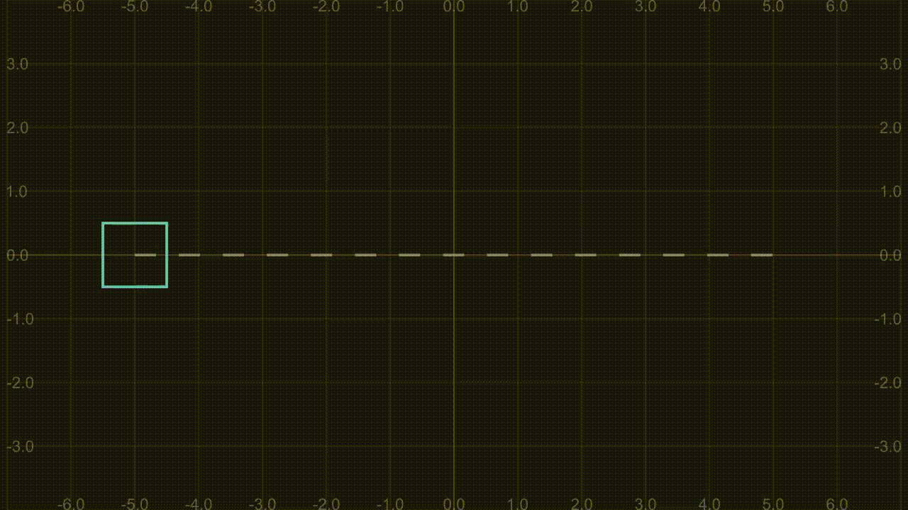</p>

### RotationAndMove

```python
# Creating a custom animation

class ShiftAndRotate(Animation):
    CONFIG = {
        "axis": OUT,
        "run_time": 5,
        "rate_func": smooth,
        "about_point": None,
        "about_edge": None,
    }
    def __init__(self, mobject, direction, radians,**kwargs):
        assert(isinstance(mobject, Mobject))
        digest_config(self, kwargs)
        self.mobject = mobject
        self.direction = direction
        self.radians = radians

    def interpolate_mobject(self, alpha):
        self.mobject.become(self.starting_mobject)
        self.mobject.shift(alpha*self.direction)
        self.mobject.rotate(
            alpha * self.radians,
            axis=self.axis,
            about_point=self.about_point,
            about_edge=self.about_edge,
        )

class RotationAndMove(Scene):
    def construct(self):
        square1, square2 = VGroup(
                Square(color=RED), Square(color=BLUE)
            ).scale(0.5).set_x(-5)

        reference = DashedVMobject(Line(LEFT*5,RIGHT*5,color=GRAY))
        self.add(square1,square2,reference)

        self.play(
                # Red square
                square1.rotate,3*PI,
                square1.move_to, [5,0,0],
                # Blue square
                ShiftAndRotate(square2, RIGHT*10, 3*PI),
                run_time=4
            )
        self.wait()
```

<p align="center"></p>

## 3. `point_from_proportion`

```python
"""
WHAT IS "point_from_proportion"
This is a path (Line):
                *---------------------------------*
                |                                 |
              start                              end

path.point_from_proportion(alpha):
             alpha = 0                       alpha = 1
                v                                 v
                *--------*-------*--------*-------*
                         ^       ^        ^
                         |  alpha = 0.5   |
                         |                |
                    alpha = 0.25     alpha = 0.75
"""
```

### RotateWithPath

```python
class RotateWithPath(Scene):
    def construct(self):
        square1, square2 = VGroup(
                Square(color=RED), Square(color=BLUE)
            ).scale(0.5).set_x(-5)

        path = Line(LEFT*5,RIGHT*5,stroke_opacity=0.5)
        path.points[1:3] += UP*2

        square2.save_state()
        def update_rotate_move(mob,alpha):
            square2.restore()
            square2.move_to(path.point_from_proportion(alpha))
            square2.rotate(3*PI*alpha)

        self.add(square1,square2,path)
        self.play(
                # Red square
                MoveAlongPath(square1,path),
                Rotate(square1,2*PI/3,about_point=square1.get_center()),
                # Blue square
                UpdateFromAlphaFunc(square2,update_rotate_move),
                run_time=4
            )
        self.wait()
```

<p align="center">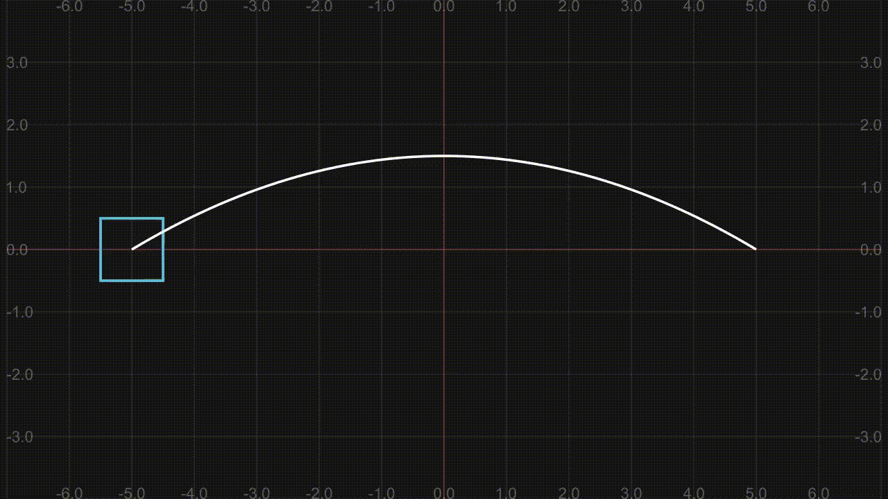</p>

### MoveAlongPathWithRotation

```python
class MoveAlongPathWithRotation(Scene):
    def get_pending(self,path,proportion,dx=0.01):
        if proportion < 1:
            coord_i = path.point_from_proportion(proportion)
            coord_f = path.point_from_proportion(proportion+dx)
        else:
            coord_i = path.point_from_proportion(proportion-dx)
            coord_f = path.point_from_proportion(proportion)
        line = Line(coord_i,coord_f)
        angle = line.get_angle()
        return angle

    def construct(self):
        # PATH
        path = Line(LEFT*5, RIGHT*5, stroke_opatity=0.5)
        path.points[1] += UP * 4
        path.points[2] += DOWN * 4
        start_angle = self.get_pending(path, 0)
        # TRIANGLE
        triangle = Triangle().set_height(0.5)
        triangle.move_to(path.get_start())
        triangle.rotate(- PI / 2)
        triangle.save_state()
        triangle.rotate(start_angle, about_point=triangle.get_center())

        def update_rotate_move(mob,alpha):
            triangle.restore()
            angle = self.get_pending(path,alpha)
            triangle.move_to(path.point_from_proportion(alpha))
            triangle.rotate(angle, about_point=triangle.get_center())

        self.add(triangle,path)
        self.play(
                UpdateFromAlphaFunc(triangle,update_rotate_move),
                run_time=4
            )
        self.wait()
```

<p align="center">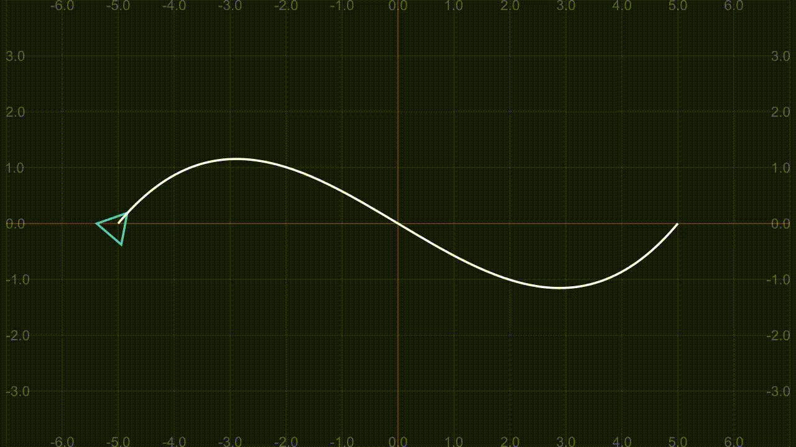</p>

### MoveAlongPathWithRotation2

```python
# Creating a custom animation

def get_path_pending(path,proportion,dx=0.001):
    if proportion < 1:
        coord_i = path.point_from_proportion(proportion)
        coord_f = path.point_from_proportion(proportion+dx)
    else:
        coord_i = path.point_from_proportion(proportion-dx)
        coord_f = path.point_from_proportion(proportion)
    line = Line(coord_i,coord_f)
    angle = line.get_angle()
    return angle

class ShiftAndRotateAlongPath(Animation):
    CONFIG = {
        "run_time": 5,
        "rate_func": smooth,
        "dx":0.01
    }
    def __init__(self, mobject, path,**kwargs):
        assert(isinstance(mobject, Mobject))
        digest_config(self, kwargs)
        self.mobject = mobject
        self.path = path

    def interpolate_mobject(self, alpha):
        self.mobject.become(self.starting_mobject)
        self.mobject.move_to(
            self.path.point_from_proportion(alpha)
        )
        angle = get_path_pending(self.path,alpha,self.dx)
        self.mobject.rotate(
            angle,
            about_point=self.mobject.get_center(),
        )

class MoveAlongPathWithRotation2(Scene):
    def construct(self):
        path = Line(LEFT*5, RIGHT*5, stroke_opatity=0.5)
        path.points[1] += UP * 4
        path.points[2] += DOWN * 4
        start_angle = get_path_pending(path, 0)

        triangle = Triangle().set_height(0.5)
        triangle.move_to(path.get_start())
        triangle.rotate(- PI / 2)

        self.add(triangle,path)
        self.play(
                ShiftAndRotateAlongPath(triangle,path),
                run_time=4
            )
        self.wait()
```

<p align="center"></p>
